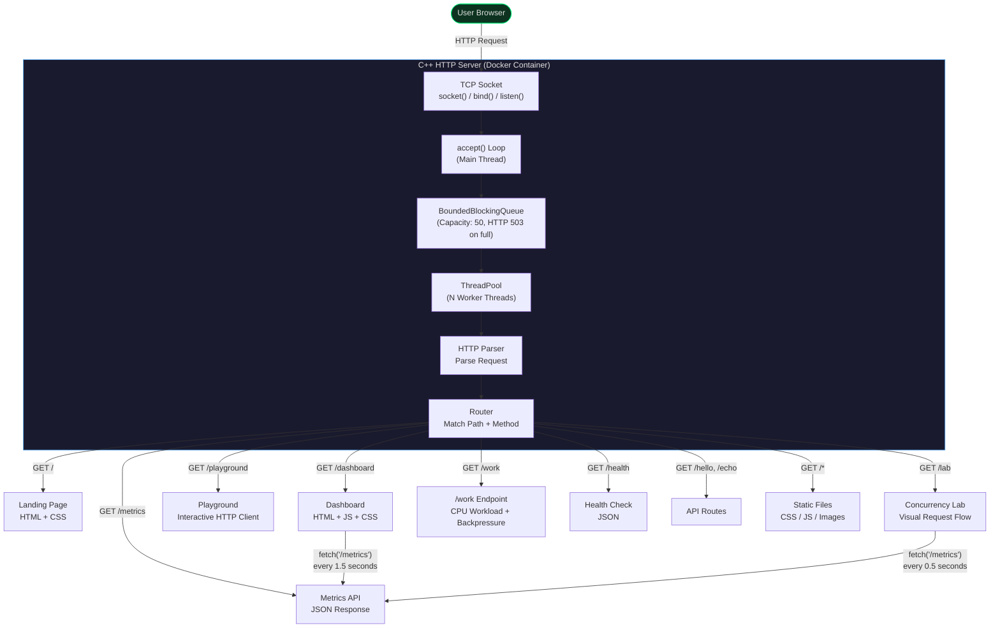

# C++ Concurrent HTTP Server

> A multithreaded HTTP/1.1 server built from scratch using C++17 and low-level TCP sockets. Demonstrates networking, concurrency, HTTP protocol handling, and real-time performance monitoring — all without any web framework.

---

## Live Demo

| | Link |
|---|---|
| **Landing Page** | [Open Live Server](https://multithreaded-http-server.onrender.com/) |
| **Dashboard** | [Open Live Dashboard](https://multithreaded-http-server.onrender.com/dashboard) |
| **Playground** | [Open Playground](https://multithreaded-http-server.onrender.com/playground) |
| **Concurrency Lab** | [Open Lab](https://multithreaded-http-server.onrender.com/lab) |
| **Metrics API** | [/metrics](https://multithreaded-http-server.onrender.com/metrics) |
| **Health Check** | [/health](https://multithreaded-http-server.onrender.com/health) |

> **Note:** Free tier hosting may take 30-60 seconds to wake up after idle.

---

## What Is This Project?

Modern web frameworks like Express, Flask, and Spring hide the complexity of networking, HTTP parsing, and concurrency. This project **peels back those abstractions** by implementing a fully functional HTTP server from first principles in C++.

### What We Built

```
┌───────────────────────────────────────────────────────────────────┐
│                    C++ CONCURRENT HTTP SERVER                     │
├───────────────────────────────────────────────────────────────────┤
│                                                                   │
│  A server that:                                                   │
│                                                                   │
│  1. Opens a raw TCP socket and listens for connections            │
│  2. Accepts multiple clients concurrently                        │
│  3. Parses HTTP/1.1 requests byte by byte                        │
│  4. Routes requests to the correct handler                       │
│  5. Serves static files, API responses, and a live dashboard     │
│  6. Tracks every metric in real-time using lock-free atomics     │
│  7. Visualizes metrics in a browser dashboard with live charts   │
│  8. Runs as a deployed Docker container on the public internet   │
│                                                                   │
│  All built with: C++17, TCP sockets, threads, mutexes, atomics   │
│                                                                   │
└───────────────────────────────────────────────────────────────────┘
```

### What Problem Does It Solve?

| Problem | Solution |
|---------|----------|
| How do servers actually handle connections? | Raw TCP socket programming with `accept()` / `recv()` / `send()` |
| How do servers handle thousands of requests? | Fixed-size thread pool with a blocking task queue |
| How does HTTP parsing work? | Hand-written parser extracts method, path, headers, body |
| How do you know if the server is healthy? | Real-time metrics exposed via `/metrics` endpoint |
| How do you visualize server performance? | Browser dashboard with live-updating charts |

---

## System Architecture

### High-Level Architecture



### Request Lifecycle — What Happens When You Visit a Page

```
    You type: https://multithreaded-http-server.onrender.com/dashboard.html
    │
    ▼
┌─────────────────────────────────────────────────────────────┐
│ STEP 1: TCP Connection                                      │
│                                                             │
│   Browser ──── TCP SYN ────▶ Server                        │
│   Browser ◀─── TCP ACK ──── Server                         │
│   Connection established on port 8080                      │
└─────────────────────────────────────────────────────────────┘
    │
    ▼
┌─────────────────────────────────────────────────────────────┐
│ STEP 2: accept() Returns File Descriptor                   │
│                                                             │
│   Main thread: accept() blocks until a client connects     │
│   Returns client_fd (file descriptor for this connection)  │
│   Client info: 203.0.113.42:54321                          │
└─────────────────────────────────────────────────────────────┘
    │
    ▼
┌─────────────────────────────────────────────────────────────┐
│ STEP 3: Task Submitted to Queue                            │
│                                                             │
│   pool.submit(handle_client(client_fd))                    │
│   Task pushed to BlockingQueue                             │
│   Main thread loops back to accept() immediately           │
└─────────────────────────────────────────────────────────────┘
    │
    ▼
┌─────────────────────────────────────────────────────────────┐
│ STEP 4: Worker Thread Picks Up Task                        │
│                                                             │
│   Worker 3: queue.wait_and_pop() → gets task               │
│   Worker 3 now executes handle_client(client_fd)           │
│   Other workers continue sleeping on condition variable    │
└─────────────────────────────────────────────────────────────┘
    │
    ▼
┌─────────────────────────────────────────────────────────────┐
│ STEP 5: Read HTTP Request                                  │
│                                                             │
│   recv(client_fd, buffer, 4096)                            │
│   Reads until "\r\n\r\n" (end of headers)                  │
│   Reads Content-Length bytes for body (if any)              │
│                                                             │
│   Raw request:                                             │
│   GET /dashboard.html HTTP/1.1                             │
│       Host: multithreaded-http-server.onrender.com                       │
│   User-Agent: Mozilla/5.0 ...                              │
└─────────────────────────────────────────────────────────────┘
    │
    ▼
┌─────────────────────────────────────────────────────────────┐
│ STEP 6: Parse HTTP Request                                 │
│                                                             │
│   HttpParser::parse(raw_request)                           │
│                                                             │
│   Result:                                                  │
│     method  = GET                                          │
│     path    = /dashboard.html                              │
│     version = HTTP/1.1                                     │
│     headers = {Host: ..., User-Agent: ...}                 │
│     body    = (empty)                                      │
└─────────────────────────────────────────────────────────────┘
    │
    ▼
┌─────────────────────────────────────────────────────────────┐
│ STEP 7: Route the Request                                  │
│                                                             │
│   Router::handle(http_request)                             │
│                                                             │
│   Lookup: routes["/dashboard.html"]["GET"]                 │
│   Found: static file handler                               │
│   Read file: /app/public/dashboard.html                    │
│   Return as HTTP response                                  │
└─────────────────────────────────────────────────────────────┘
    │
    ▼
┌─────────────────────────────────────────────────────────────┐
│ STEP 8: Send HTTP Response                                 │
│                                                             │
│   HttpResponse::serialize()                                │
│   Builds: "HTTP/1.1 200 OK\r\nContent-Type: text/html..." │
│                                                             │
│   send_all(client_fd, response)                            │
│   Writes complete response to socket                       │
└─────────────────────────────────────────────────────────────┘
    │
    ▼
┌─────────────────────────────────────────────────────────────┐
│ STEP 9: Update Metrics & Log                               │
│                                                             │
│   total_requests++ (atomic, no lock)                       │
│   successful_requests++ (atomic)                           │
│   total_bytes_sent += response_size (atomic)               │
│   record_latency(2.4ms) (mutex-protected)                  │
│   active_connections-- (atomic)                            │
│                                                             │
│   Log: GET /dashboard.html → 200 (2.4 ms) [203.0.113.42]  │
└─────────────────────────────────────────────────────────────┘
    │
    ▼
┌─────────────────────────────────────────────────────────────┐
│ STEP 10: Close Connection                                  │
│                                                             │
│   close(client_fd)                                         │
│   Connection released                                      │
│   Worker thread goes back to waiting for next task         │
└─────────────────────────────────────────────────────────────┘
```

---

## Concurrency Model — How the Thread Pool Works

### The Problem: Thread-Per-Connection

```
Without thread pool (BAD):

10,000 concurrent clients
        │
        ▼
10,000 threads created
        │
        ▼
OS tries to schedule 10,000 threads
        │
        ▼
Context switching overhead: O(n²)
Memory: ~8GB for thread stacks
Result: CRASH or extreme slowness
```

### The Solution: Fixed-Size Thread Pool with Bounded Queue

```
With thread pool + bounded queue (GOOD):

10,000 concurrent clients
        │
        ▼
    ┌───────────────────┐
    │ BoundedQueue      │ ← Capacity: 50 tasks
    │ (capacity: 50)    │   HTTP 503 when full!
    └─────────┬─────────┘
              │
    ┌─────────┼─────────┐
    ▼         ▼         ▼
 Worker 1  Worker 2  Worker 8    ← Only 8 threads
    │         │         │
    └─────────┼─────────┘
              ▼
     Process requests one at a time
     Each worker handles ~1250 clients sequentially
     
If queue full: HTTP 503 "Service Unavailable"
Retry-After: 5 seconds

Memory: ~8MB for thread stacks
Result: STABLE, PREDICTABLE, GRACEFUL DEGRADATION
```

### Thread Pool Internals

```
┌──────────────────────────────────────────────────────────────┐
│                     THREAD POOL                              │
│                                                              │
│  ┌──────────────────────────────────────────────────────┐   │
│  │           BoundedBlockingQueue (capacity: 50)         │   │
│  │                                                       │   │
│  │   std::queue<std::function<void()>>                  │   │
│  │   std::mutex  (protects the queue)                   │   │
│  │   std::condition_variable  (sleep/wake workers)      │   │
│  │   std::size_t capacity_  (max queue size)            │   │
│  │                                                       │   │
│  │   push(task)  → returns false if full (backpressure) │   │
│  │   wait_and_pop() → blocks until item or shutdown     │   │
│  └──────────────────────────────────────────────────────┘   │
│                          │                                   │
│        ┌─────────────────┼─────────────────┐                │
│        ▼                 ▼                 ▼                │
│   ┌─────────┐      ┌─────────┐      ┌─────────┐           │
│   │Worker 1 │      │Worker 2 │      │Worker N │           │
│   │         │      │         │      │         │           │
│   │ while(1){      │ while(1){      │ while(1){           │
│   │   task =       │   task =       │   task =             │
│   │   queue.pop()  │   queue.pop()  │   queue.pop()        │
│   │   active++     │   active++     │   active++           │
│   │   task()       │   task()       │   task()             │
│   │   active--     │   active--     │   active--           │
│   │ }              │ }              │ }                    │
│   │ (sleeps when   │ (sleeps when   │ (sleeps when         │
│   │  queue empty)  │  queue empty)  │  queue empty)        │
│   └─────────┘      └─────────┘      └─────────┘           │
│                                                              │
│  Synchronization:                                            │
│  - mutex: protects queue access                             │
│  - condition_variable: workers sleep when idle               │
│  - atomic<bool> stopped_: shutdown signal                    │
│  - atomic<size_t> active_workers_: currently processing     │
│                                                              │
└──────────────────────────────────────────────────────────────┘
```

### Why This Design?

| Design Choice | Reason | Trade-off |
|--------------|--------|-----------|
| Fixed thread pool | Bounds resource usage, O(1) thread creation | Workers block on slow I/O |
| Bounded blocking queue | Prevents OOM, enables backpressure (503) | Must tune capacity to workload |
| Active worker tracking | Real-time utilization metrics | One atomic increment/decrement per request |
| Condition variable | Efficient sleep/wake (no busy-wait) | Spurious wakeups handled |
| `std::atomic` metrics | Lock-free counters on hot path | Can't use for complex types |
| `std::mutex` for latency | `atomic<double>` lacks `fetch_add` | Small contention window |
| `Connection: close` | Simple, no state management | No connection reuse |

---

## Metrics System — What the Server Tracks

### How Metrics Flow

```
┌─────────────────────────────────────────────────────────────┐
│                    C++ SERVER                               │
│                                                             │
│  Worker Thread (hot path)                                   │
│       │                                                     │
│       ├── connection_opened()                               │
│       │     active_connections++     (atomic fetch_add)     │
│       │     peak_connections = max() (CAS loop)             │
│       │                                                     │
│       ├── record_request()                                  │
│       │     total_requests++        (atomic fetch_add)     │
│       │                                                     │
│       │   ... processing ...                                │
│       │                                                     │
│       ├── record_success() or record_client_error()         │
│       │     successful_requests++ or client_errors++        │
│       │                                                     │
│       ├── add_bytes_sent(n)                                 │
│       │     total_bytes_sent += n    (atomic fetch_add)     │
│       │                                                     │
│       ├── record_latency(ms)                                │
│       │     total_latency_ms += ms   (mutex protected)     │
│       │     latency_count++                                 │
│       │                                                     │
│       └── connection_closed()                               │
│             active_connections--     (atomic fetch_sub)     │
│                                                             │
│  All counters use std::atomic<uint64_t>                     │
│  No locks on the hot path (except latency)                  │
│                                                             │
└──────────────────────────┬──────────────────────────────────┘
                           │
                           ▼
              GET /metrics → to_json()
                           │
                           ▼
                    JSON Response
                           │
                           ▼
              Browser Dashboard (updates every 1.5s)
```

### Metrics Reference

| Metric | Type | What It Measures | How It's Updated |
|--------|------|-----------------|------------------|
| `total_requests` | counter | Total requests since startup | `fetch_add(1)` on each request |
| `successful_requests` | counter | 2xx responses returned | `fetch_add(1)` on success |
| `client_errors` | counter | 4xx responses returned | `fetch_add(1)` on client error |
| `server_errors` | counter | 5xx responses returned (includes 503 backpressure) | `fetch_add(1)` on server error |
| `active_connections` | gauge | Currently open connections | `fetch_add(1)` on accept, `fetch_sub(1)` on close |
| `peak_connections` | gauge | Highest concurrent connections | CAS loop: if current > peak, update |
| `total_bytes_sent` | counter | Total response bytes transmitted | `fetch_add(bytes)` after each send |
| `average_latency_ms` | gauge | Mean request processing time | `mutex` protected sum/count |
| `uptime_seconds` | gauge | Time since server started | `steady_clock::now() - start_time` |
| `requests_per_second` | computed | Total requests / uptime | Computed in `to_json()` |
| `worker_threads` | info | Configured worker thread count | Set once at startup |
| `active_workers` | gauge | Workers currently processing requests | Atomic counter, incremented on task pickup |
| `idle_workers` | gauge | Workers waiting for tasks | Computed: worker_threads - active_workers |
| `queue_size` | gauge | Pending tasks in queue | Updated on each request |
| `queue_capacity` | info | Maximum queue size (backpressure threshold) | Set once at startup |

### Example /metrics Response

```json
{
  "total_requests": 1247,
  "successful_requests": 1240,
  "client_errors": 5,
  "server_errors": 2,
  "active_connections": 3,
  "peak_connections": 12,
  "total_bytes_sent": 1245184,
  "average_latency_ms": 2.4,
  "requests_per_second": 45.20,
  "uptime_seconds": 4823,
  "worker_threads": 4,
  "active_workers": 2,
  "idle_workers": 2,
  "queue_size": 0,
  "queue_capacity": 50
}
```

---

## Live Dashboard — Real-Time Monitoring

The dashboard at `/dashboard` visualizes all metrics in real-time, including worker utilization and queue status.

### Dashboard Preview

```
┌─────────────────────────────────────────────────────────────────────┐
│  Live Monitoring Dashboard                    [Home] [Playground]  │
├─────────────────────────────────────────────────────────────────────┤
│                                                                     │
│  ┌──────────────┐ ┌──────────────┐ ┌──────────────┐ ┌────────────┐ │
│  │ TOTAL        │ │ SUCCESSFUL   │ │ CLIENT       │ │ SERVER     │ │
│  │ REQUESTS     │ │              │ │ ERRORS       │ │ ERRORS     │ │
│  │   1,247      │ │   1,240      │ │     5        │ │     2      │ │
│  └──────────────┘ └──────────────┘ └──────────────┘ └────────────┘ │
│                                                                     │
│  ┌──────────────┐ ┌──────────────┐ ┌──────────────┐ ┌────────────┐ │
│  │ ACTIVE       │ │ PEAK         │ │ AVG          │ │ REQ/SEC    │ │
│  │ CONNECTIONS  │ │ CONNECTIONS  │ │ LATENCY      │ │            │ │
│  │      3       │ │     12       │ │  2.40 ms     │ │  45.20     │ │
│  └──────────────┘ └──────────────┘ └──────────────┘ └────────────┘ │
│                                                                     │
│  ┌──────────────┐ ┌──────────────┐ ┌──────────────┐ ┌────────────┐ │
│  │ WORKER       │ │ ACTIVE       │ │ IDLE         │ │ WORKER     │ │
│  │ THREADS      │ │ WORKERS      │ │ WORKERS      │ │ UTIL       │ │
│  │     4        │ │     2        │ │     2        │ │    50%     │ │
│  └──────────────┘ └──────────────┘ └──────────────┘ └────────────┘ │
│                                                                     │
│  ┌──────────────┐ ┌──────────────┐                                  │
│  │ QUEUE SIZE   │ │ QUEUE        │                                  │
│  │      0       │ │ CAPACITY     │                                  │
│  │              │ │     50       │                                  │
│  └──────────────┘ └──────────────┘                                  │
│                                                                     │
│  ┌────────────────────────────┐ ┌────────────────────────────────┐ │
│  │  Requests Per Second       │ │  Average Latency (ms)          │ │
│  │  ▁▂▃▅▆▅▄▃▂▁▂▃▅▆▅▄▃▂▁    │ │  ▁▁▂▂▁▁▂▃▃▂▂▁▁▂▂▁▁▂▃▃▂▂    │ │
│  │  (last 60 seconds)         │ │  (last 60 seconds)             │ │
│  └────────────────────────────┘ └────────────────────────────────┘ │
└─────────────────────────────────────────────────────────────────────┘
```

---

## Project Capabilities

| Capability | Implementation | Status |
|------------|---------------|--------|
| TCP Networking | Raw sockets: `socket() / bind() / listen() / accept() / recv() / send()` | Done |
| HTTP/1.1 Protocol | Request line, headers, Content-Length body parsing | Done |
| Concurrency | Fixed-size thread pool with bounded blocking task queue | Done |
| Backpressure | Bounded queue with HTTP 503 Service Unavailable when full | Done |
| Active Worker Tracking | Atomic counter for real-time worker utilization metrics | Done |
| Synchronization | `mutex` + `condition_variable` for queue, `atomic` for metrics | Done |
| Routing | Path/method matching, 404/405 with Allow headers | Done |
| Static File Serving | MIME detection, directory traversal prevention, path normalization | Done |
| CPU Workload Endpoint | `/work?delay=N&body=N` for concurrency demos and backpressure testing | Done |
| Interactive Playground | `/playground` - Send requests, inspect responses, request history | Done |
| Concurrency Lab | `/lab` - Visualize thread pool, queue, worker status in real-time | Done |
| Thread-Safe Logging | Mutex-protected structured logs with timestamp, level, thread ID | Done |
| Atomic Metrics | Lock-free counters for requests, bytes, connections | Done |
| Live Dashboard | Browser-based monitoring with Canvas charts, auto-refresh | Done |
| Docker Support | Multi-stage build, minimal runtime image | Done |
| Cloud Deployment | Render.com with auto-deploy from GitHub | Done |
| Cross-Platform | Windows (Winsock2) and Linux (POSIX sockets) | Done |
| Graceful Shutdown | SIGINT/SIGTERM handling, thread pool drain, socket cleanup | Done |
| Health Endpoint | `/health` returns `{"status":"ok"}` for uptime monitoring | Done |
| Environment Config | `PORT`, `QUEUE_CAPACITY` env variables for deployment platforms | Done |

---

## Deployment Architecture

### How It Gets From Your Code to the Public Internet

```mermaid
flowchart LR
    Dev["👨‍💻 Developer<br/>git push"] -->|push| GH["📦 GitHub<br/>Repository"]
    GH -->|webhook| Render["☁️ Render.com<br/>Build Server"]
    Render -->|docker build| Image["🐳 Docker Image<br/>Ubuntu 22.04 + C++"]
    Image -->|deploy| Container["📦 Container<br/>C++ Server Running"]
    Container -->|listens| URL["🌐 Public URL<br/>https://cpp-http-server.onrender.com"]
    URL -->|visit| User(["👤 Anyone on<br/>the Internet"])
    
    style Dev fill:#4facfe,stroke:#333,color:#000
    style GH fill:#333,stroke:#4facfe,color:#fff
    style Render fill:#4facfe,stroke:#333,color:#000
    style Container fill:#0d3320,stroke:#00e676,color:#fff
    style URL fill:#0d3320,stroke:#00e676,color:#fff
    User -->|"visit https://<br/>multithreaded-http-server.onrender.com"| URL
```



### Automatic Redeployment Flow

```
After initial setup, every update is just:

    git add .
    git commit -m "update feature"
    git push
        │
        ▼
    GitHub receives push
        │
        ▼
    Sends webhook to Render
        │
        ▼
    Render pulls latest code
        │
        ▼
    Builds new Docker image
        │
        ▼
    Deploys new container
        │
        ▼
    Public URL updated automatically
        │
        ▼
    Zero downtime (new container starts before old one stops)
```

### Docker Architecture

```
┌─────────────────────────────────────────────────┐
│  BUILD STAGE (ubuntu:22.04)                     │
│                                                 │
│  Install: g++ cmake ninja-build                 │
│  Copy: source code + headers                    │
│  Build: cmake -DCMAKE_BUILD_TYPE=Release        │
│  Output: http_server binary                     │
│                                                 │
└──────────────────────┬──────────────────────────┘
                       │
                       ▼
┌─────────────────────────────────────────────────┐
│  RUNTIME STAGE (ubuntu:22.04)                   │
│                                                 │
│  Copy: http_server binary from build stage      │
│  Copy: public/ directory (HTML, CSS, JS)        │
│  Expose: port 8080                              │
│  ENV: PORT=8080, THREADS=4                      │
│  CMD: ./http_server --port $PORT --threads $THREADS │
│                                                 │
│  Final image: ~50MB (no build tools)            │
│                                                 │
└─────────────────────────────────────────────────┘
```

---

## Project Structure

```
├── src/                              # Server implementation
│   ├── main.cpp                      # Entry point, signal handling, Winsock init
│   ├── tcp_server.cpp                # Socket bind/listen/accept, backpressure handling
│   ├── http_parser.cpp               # HTTP/1.1 request parser
│   ├── router.cpp                    # Route definitions, /work, /playground, /lab
│   ├── static_file_handler.cpp       # File serving, MIME types, path security
│   ├── http_response.cpp             # (inline in header)
│   ├── logger.cpp                    # (inline in header)
│   └── metrics.cpp                   # (inline in header)
│
├── include/server/                   # Header files
│   ├── config.hpp                    # Configuration + CLI + env parsing
│   ├── tcp_server.hpp                # TcpServer class
│   ├── thread_pool.hpp               # Fixed-size thread pool with worker tracking
│   ├── blocking_queue.hpp            # Bounded thread-safe blocking queue
│   ├── http_parser.hpp               # HTTP parser declaration
│   ├── http_request.hpp              # HttpRequest struct, HttpMethod enum
│   ├── http_response.hpp             # HttpResponse builder, StatusCode enum
│   ├── router.hpp                    # Router class
│   ├── metrics.hpp                   # Atomic metrics singleton (15 fields)
│   ├── logger.hpp                    # Thread-safe logger singleton
│   └── socket_compat.hpp             # Cross-platform socket abstraction
│
├── public/                           # Frontend (served by C++ server)
│   ├── index.html                    # Landing page
│   ├── dashboard.html                # Live monitoring dashboard
│   ├── dashboard.js                  # Metrics fetching + Canvas charts
│   ├── dashboard.css                 # Dashboard styling
│   ├── playground.html               # Interactive HTTP client
│   ├── lab.html                      # Concurrency lab with visualization
│   └── style.css                     # Landing page styling
│
├── tests/                            # 41 unit tests
│   ├── test_framework.hpp            # Lightweight test macros
│   ├── test_main.cpp                 # Test runner
│   ├── test_http_parser.cpp          # 10 parser tests
│   ├── test_router.cpp               # 10 router tests
│   ├── test_thread_pool.cpp          # 8 thread pool tests
│   └── test_static_files.cpp         # 13 static file tests
│
├── deploy/
│   └── http-server.service           # systemd unit file
│
├── docs/
│   ├── architecture.md               # Detailed architecture docs
│   ├── deployment.md                 # Deployment guide
│   └── interview-guide.md            # Interview prep with Q&A
│
├── Dockerfile                        # Multi-stage Docker build
├── docker-compose.yml                # Docker Compose config
├── render.yaml                       # Render.com deployment config
├── CMakeLists.txt                    # Build configuration
└── README.md                         # This file
```

---

## Quick Start

### Run Locally

```bash
# Build
cmake -S . -B build -G Ninja -DCMAKE_BUILD_TYPE=Release
cmake --build build

# Run
./build/http_server --port 8080 --threads 4 --capacity 50

# Open in browser
# http://localhost:8080/           <- Landing page
# http://localhost:8080/dashboard  <- Live dashboard
# http://localhost:8080/playground <- Interactive HTTP client
# http://localhost:8080/lab        <- Concurrency lab
```

### Run with Docker

```bash
docker build -t cpp-http-server .
docker run -p 8080:8080 cpp-http-server
```

### Run Tests

```bash
./build/tests/server_tests
# Expected: 41/41 tests passed
```

### Test Backpressure

```bash
# Fire 200 concurrent requests to /work (delay 500ms each)
# With queue capacity 50, expect ~150 HTTP 503 responses
ab -n 200 -c 200 "http://localhost:8080/work?delay=500"
```

### Command-Line Options

| Flag | Default | Env Variable | Description |
|------|---------|-------------|-------------|
| `--port PORT` | 8080 | `PORT` | Server listen port |
| `--threads N` | hardware concurrency | `THREADS` | Worker thread count |
| `--capacity N` | 50 | `QUEUE_CAPACITY` | Queue capacity (backpressure threshold) |
| `--root PATH` | `public` | — | Static files directory |

---

## API Endpoints

| Method | Path | Description | Response |
|--------|------|-------------|----------|
| GET | `/` | Landing page | HTML |
| GET | `/dashboard` | Live monitoring dashboard | HTML |
| GET | `/playground` | Interactive HTTP client | HTML |
| GET | `/lab` | Concurrency lab with visualization | HTML |
| GET | `/work` | CPU workload endpoint (configurable delay) | JSON with timing |
| GET | `/health` | Health check | `{"status":"ok"}` |
| GET | `/hello` | Hello world | `Hello, World!` |
| GET | `/metrics` | Server metrics (all fields) | JSON |
| POST | `/echo` | Echo request body | Plain text |
| HEAD | `/hello` | HEAD for hello | Empty body |
| HEAD | `/health` | HEAD for health | Empty body |

---

## Tech Stack

| Layer | Technology |
|-------|-----------|
| **Language** | C++17 |
| **Networking** | Raw TCP sockets (POSIX / Winsock2) |
| **Concurrency** | `std::thread`, `std::mutex`, `std::condition_variable` |
| **Metrics** | `std::atomic<uint64_t>` (lock-free counters) |
| **Build** | CMake + Ninja |
| **Frontend** | HTML5, CSS3, Vanilla JavaScript (Canvas API) |
| **Packaging** | Docker (multi-stage build) |
| **Deployment** | Render.com (auto-deploy from GitHub) |

---

## Testing

```bash
./build/tests/server_tests
```

| Test Suite | Tests | Coverage |
|-----------|-------|----------|
| HTTP Parser | 10 | GET/POST/HEAD, headers, body, malformed requests |
| Router | 10 | Route matching, 404, 405, metrics, dashboard |
| Thread Pool | 8 | Task execution, concurrency, FIFO, shutdown |
| Static Files | 13 | File serving, MIME types, directory traversal prevention |
| **Total** | **41** | **All passing** |

### Load Testing Backpressure

```bash
# Quick test: queue capacity 10, 50 concurrent requests
ab -n 50 -c 50 "http://localhost:8080/work?delay=200"

# Watch for 503 responses in the output:
# Non-2xx responses: ~40 (these are 503 Service Unavailable)
```

---

## Why This Project?

> High-level frameworks like Express, Flask, and Spring hide the complexity of networking, HTTP parsing, and concurrency. This project explores those underlying mechanisms by implementing a concurrent HTTP server from scratch using C++ and TCP sockets, then exposing its runtime behavior through a live browser-based monitoring dashboard.

### What This Demonstrates

```
C++ Systems Programming
        +
Computer Networking (TCP/IP)
        +
HTTP Protocol Handling
        +
Multithreading & Concurrency
        +
Bounded Queues & Backpressure (HTTP 503)
        +
Synchronization (mutex, condvar, atomics)
        +
Real-Time Worker Utilization Tracking
        +
Software Architecture
        +
Real-Time Metrics & Monitoring
        +
Interactive HTTP Client (Playground)
        +
Concurrency Visualization (Lab)
        +
Docker Containerization
        +
Cloud Deployment
```

---

## Limitations

| Limitation | Reason | Future Improvement |
|-----------|--------|-------------------|
| No HTTP/1.1 keep-alive | Connection: close simplicity | Add idle timeouts, max requests per connection |
| No TLS/HTTPS | Educational scope | Use Nginx reverse proxy for HTTPS |
| No chunked transfer encoding | Only Content-Length supported | Add Transfer-Encoding: chunked |
| Synchronous I/O | Blocking recv/send in workers | Use epoll/kqueue for I/O multiplexing |
| No URL query parsing | `?key=value` ignored | Add query string parser |
| Free tier may sleep | Render free tier spins down after inactivity | Upgrade to paid plan for 24/7 |

---

## Future Improvements

- HTTP/1.1 keep-alive with idle timeouts
- `epoll` / `kqueue` / `io_uring` for high-performance I/O
- TLS support via OpenSSL
- Prometheus-compatible metrics endpoint
- Rate limiting per IP
- URL path parameters (`/users/:id`)
- Request body streaming

---

## License

MIT
