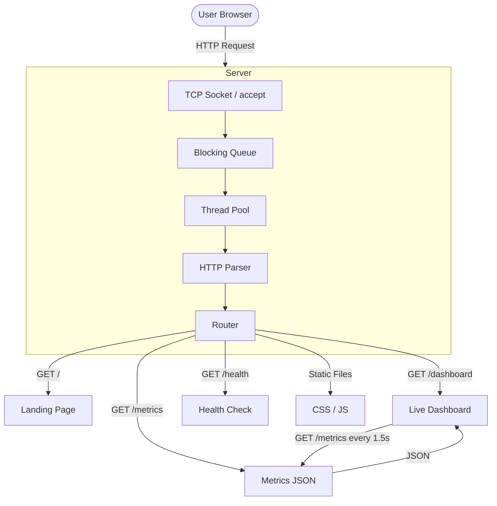

# C++ Concurrent HTTP Server

> A multithreaded HTTP/1.1 server built from scratch using C++17 and low-level TCP sockets. Demonstrates networking, concurrency, HTTP protocol handling, and real-time performance monitoring.

---

## Live Demo

| | Link |
|---|---|
| **Server** | [Open Live Demo](https://cpp-http-server.onrender.com/) |
| **Dashboard** | [Open Live Dashboard](https://cpp-http-server.onrender.com/dashboard.html) |
| **Metrics API** | [/metrics](https://cpp-http-server.onrender.com/metrics) |
| **Health Check** | [/health](https://cpp-http-server.onrender.com/health) |

> **Note:** The server may take 30-60 seconds to wake up on free tier hosting.

---

## Project at a Glance

```
┌───────────────────────────────────────────────────────┐
│          C++ CONCURRENT HTTP SERVER                   │
├───────────────────────────────────────────────────────┤
│                                                       │
│   C++17 · TCP/IP · HTTP/1.1 · Thread Pool             │
│   Multithreading · Atomic Metrics · Docker             │
│                                                       │
│   Browser-based live monitoring dashboard              │
│   Real-time performance metrics                        │
│   Publicly deployed and accessible                     │
│                                                       │
└───────────────────────────────────────────────────────┘
```

---

## System Architecture



---

## Request Lifecycle

```
Client Request
     │
     ▼
  accept()
     │
     ▼
  Task → BlockingQueue
     │
     ▼
  Worker Thread
     │
     ├── recv_request()        Read HTTP data
     ├── HttpParser::parse()   Extract method, path, headers, body
     ├── Router::handle()      Match route → call handler
     ├── Handler()             Generate response
     ├── HttpResponse::serialize()  Build HTTP/1.1 response
     ├── send_all()            Write response to socket
     └── close()               Close connection
     │
     ▼
  Update Metrics (atomic counters)
     │
     ▼
  Log Entry: GET /hello → 200 (0.4 ms) [127.0.0.1:54321]
```

---

## Concurrency Model

```
                    Incoming Connections
                            │
                            ▼
                     accept() Loop
                            │
                            ▼
                  ┌─────────────────┐
                  │  BlockingQueue  │
                  │  (thread-safe)  │
                  └────────┬────────┘
                           │
            ┌──────────────┼──────────────┐
            ▼              ▼              ▼
        Worker 1       Worker 2       Worker N
        (sleeps on     (sleeps on     (sleeps on
         condvar)       condvar)       condvar)
            │              │              │
            └──────────────┼──────────────┘
                           ▼
                    HTTP Processing
```

**Key design decisions:**
- **Thread pool** over thread-per-connection — bounds resource usage
- **Blocking queue** — workers sleep when idle (zero CPU waste)
- **Atomic counters** — lock-free metrics on hot path
- **Mutex** — only for latency tracking (`atomic<double>` lacks `fetch_add`)

---

## Live Metrics Architecture

```
C++ SERVER
     │
     ├── total_requests      (atomic<uint64_t>)
     ├── successful_requests (atomic<uint64_t>)
     ├── client_errors       (atomic<uint64_t>)
     ├── server_errors       (atomic<uint64_t>)
     ├── active_connections  (atomic<int64_t>)
     ├── peak_connections    (atomic<uint64_t>)
     ├── total_bytes_sent    (atomic<uint64_t>)
     ├── average_latency_ms  (mutex-protected)
     ├── thread_count        (atomic<uint64_t>)
     └── queue_size          (atomic<uint64_t>)
     │
     ▼
GET /metrics → JSON → Browser Dashboard (updates every 1.5s)
```

### Metrics Tracked

| Metric | Type | Description |
|--------|------|-------------|
| Total Requests | counter | Requests received since startup |
| Successful Requests | counter | 2xx responses |
| Client Errors | counter | 4xx responses |
| Server Errors | counter | 5xx responses |
| Active Connections | gauge | Currently open connections |
| Peak Connections | gauge | Highest concurrent connections |
| Avg Latency | gauge | Mean request processing time (ms) |
| Bytes Sent | counter | Total response bytes transmitted |
| Uptime | gauge | Time since server started |
| Requests/sec | computed | Total requests / uptime seconds |
| Worker Threads | info | Configured thread pool size |
| Queue Size | gauge | Pending tasks in queue |

---

## Dashboard Preview

```
┌─────────────────────────────────────────────────────────────┐
│  Live Monitoring Dashboard                    ● ONLINE      │
├─────────────────────────────────────────────────────────────┤
│                                                             │
│  ┌──────────┐ ┌──────────┐ ┌──────────┐ ┌──────────┐      │
│  │ TOTAL    │ │ SUCCESS  │ │ CLIENT   │ │ SERVER   │      │
│  │ REQUESTS │ │          │ │ ERRORS   │ │ ERRORS   │      │
│  │  1,247   │ │  1,240   │ │    5     │ │    2     │      │
│  └──────────┘ └──────────┘ └──────────┘ └──────────┘      │
│                                                             │
│  ┌──────────┐ ┌──────────┐ ┌──────────┐ ┌──────────┐      │
│  │ ACTIVE   │ │ PEAK     │ │ AVG      │ │ REQ/SEC  │      │
│  │ CONN.    │ │ CONN.    │ │ LATENCY  │ │          │      │
│  │    3     │ │   12     │ │ 2.4 ms   │ │ 45.20    │      │
│  └──────────┘ └──────────┘ └──────────┘ └──────────┘      │
│                                                             │
│  ┌─────────────────────┐ ┌─────────────────────┐           │
│  │ Requests Per Second │ │ Avg Latency (ms)    │           │
│  │   ▁▂▃▅▆▅▄▃▂▁▂▃▅▆  │ │   ▁▁▂▂▁▁▂▃▃▂▂▁▁  │           │
│  └─────────────────────┘ └─────────────────────┘           │
│                                                             │
│  ┌──────────┐ ┌──────────┐ ┌──────────┐ ┌──────────┐      │
│  │ BYTES    │ │ UPTIME   │ │ THREADS  │ │ QUEUE    │      │
│  │ SENT     │ │          │ │          │ │ SIZE     │      │
│  │ 1.2 MB   │ │ 2h 14m   │ │    4     │ │    0     │      │
│  └──────────┘ └──────────┘ └──────────┘ └──────────┘      │
└─────────────────────────────────────────────────────────────┘
```

---

## Capabilities

| Capability | Implementation |
|------------|---------------|
| Networking | Raw TCP sockets (cross-platform) |
| Protocol | HTTP/1.1 request parsing |
| Concurrency | Fixed-size thread pool |
| Synchronization | mutex + condition_variable |
| Queue | Thread-safe blocking queue |
| Routing | Path/method matching with 405 support |
| Static Files | MIME detection, path traversal prevention |
| Metrics | Thread-safe atomic counters |
| Logging | Structured logging with timestamps |
| Frontend | HTML / CSS / Vanilla JavaScript |
| Monitoring | Real-time browser dashboard |
| Packaging | Docker (multi-stage build) |
| Deployment | Render.com (auto-deploy from GitHub) |

---

## Deployment Architecture


---

## Project Structure

```
├── src/                    # Server implementation
│   ├── main.cpp            # Entry point, signal handling
│   ├── tcp_server.cpp      # Socket bind/listen/accept
│   ├── http_parser.cpp     # HTTP/1.1 parser
│   ├── router.cpp          # Route definitions
│   └── static_file_handler.cpp
│
├── include/server/         # Header files
│   ├── config.hpp          # Configuration + CLI parsing
│   ├── tcp_server.hpp      # TCP server class
│   ├── thread_pool.hpp     # Fixed-size thread pool
│   ├── blocking_queue.hpp  # Thread-safe queue
│   ├── http_parser.hpp     # Parser declaration
│   ├── http_request.hpp    # Request struct
│   ├── http_response.hpp   # Response builder
│   ├── router.hpp          # Router class
│   ├── metrics.hpp         # Atomic metrics singleton
│   ├── logger.hpp          # Thread-safe logger
│   └── socket_compat.hpp   # Cross-platform sockets
│
├── public/                 # Frontend (served by C++ server)
│   ├── index.html          # Landing page
│   ├── dashboard.html      # Live monitoring dashboard
│   ├── dashboard.js        # Metrics fetching + charts
│   ├── dashboard.css       # Dashboard styling
│   └── style.css           # Landing page styling
│
├── tests/                  # 41 unit tests
├── deploy/                 # systemd service file
├── docs/                   # Architecture & deployment docs
├── Dockerfile              # Multi-stage Docker build
├── docker-compose.yml      # Docker Compose
├── render.yaml             # Render.com deployment config
└── CMakeLists.txt          # Build configuration
```

---

## Quick Start

### Run Locally

```bash
# Build
cmake -S . -B build -G Ninja -DCMAKE_BUILD_TYPE=Release
cmake --build build

# Run
./build/http_server --port 8080

# Open
# http://localhost:8080/
# http://localhost:8080/dashboard.html
```

### Docker

```bash
docker build -t cpp-http-server .
docker run -p 8080:8080 cpp-http-server
```

### Run Tests

```bash
./build/tests/server_tests
# 41/41 tests passed
```

---

## Tech Stack

```
┌─────────────────────────────────────────┐
│              TECH STACK                 │
├─────────────────────────────────────────┤
│                                         │
│  Backend                                │
│  ├── C++17                              │
│  ├── Raw TCP Sockets                    │
│  ├── std::thread / std::mutex           │
│  ├── std::atomic                        │
│  └── CMake + Ninja                      │
│                                         │
│  Frontend                               │
│  ├── HTML5                              │
│  ├── CSS3 (Grid, Flexbox)               │
│  └── Vanilla JavaScript (Canvas API)    │
│                                         │
│  Deployment                             │
│  ├── Docker (multi-stage)               │
│  ├── Render.com (auto-deploy)           │
│  └── GitHub Actions (CI)                │
│                                         │
└─────────────────────────────────────────┘
```

---

## Why This Project?

> High-level frameworks like Express, Flask, and Spring hide the complexity of networking, HTTP parsing, and concurrency. This project explores those underlying mechanisms by implementing a concurrent HTTP server from scratch using C++ and TCP sockets, then exposing its runtime behavior through a live browser-based monitoring dashboard.

---

## Future Improvements

- HTTP/1.1 keep-alive with idle timeouts
- `epoll` / `kqueue` for high-performance I/O multiplexing
- TLS support via OpenSSL
- Prometheus-compatible metrics endpoint
- Rate limiting per IP
- URL query parameter parsing

---

## License

MIT
