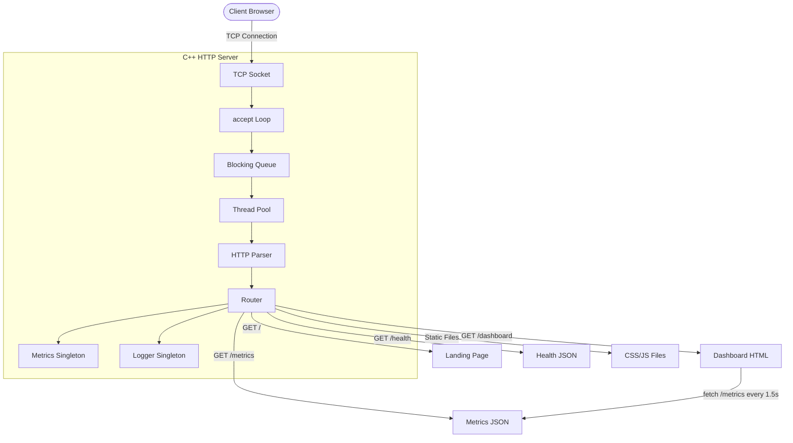

# Architecture

## High-Level System



---

## Thread Pool Concurrency Model

### Problem
Thread-per-connection creates unbounded threads under high load:
- 10,000 connections = 10,000 threads
- OS scheduling overhead explodes
- Memory exhaustion risk

### Solution
Fixed-size thread pool bounds resource usage:
- 8 workers handle any number of connections
- Workers sleep on condition variable when idle (zero CPU)
- Task queue decouples accept rate from processing rate

### Implementation

```
accept() loop (main thread)
     │
     │ pool.submit(handle_client(fd))
     ▼
BlockingQueue<function<void()>>
     │
     ├── Worker 1: queue.wait_and_pop() → execute → loop
     ├── Worker 2: queue.wait_and_pop() → execute → loop
     └── Worker N: queue.wait_and_pop() → execute → loop
```

**Trade-off:** Blocking I/O in worker threads. Under extreme load, all workers can be blocked on slow clients. Acceptable for educational scope.

---

## Blocking Queue Design

```
Producer (accept loop)          Consumer (worker threads)
     │                                │
     │ queue.push(task)               │ queue.wait_and_pop()
     ▼                                ▼
┌──────────────────────────────────────────┐
│ std::queue<T>                            │
│ std::mutex (protects queue)              │
│ std::condition_variable (sleep/wake)     │
│ bool shutdown_ (终止 signal)             │
└──────────────────────────────────────────┘
```

- `push()`: lock, push, `notify_one()`
- `wait_and_pop()`: lock, wait on CV until item or shutdown, pop
- `shutdown()`: set flag, `notify_all()` to wake all waiters

---

## HTTP Request Lifecycle

```
1.  Client connects via TCP
2.  accept() returns client_fd
3.  fd submitted to BlockingQueue
4.  Worker thread dequeues task
5.  recv_request() reads until \r\n\r\n + Content-Length body
6.  HttpParser::parse() extracts method, path, headers, body
7.  Router::handle() matches path → dispatches to handler
8.  Handler returns HttpResponse
9.  HttpResponse::serialize() builds "HTTP/1.1 200 OK\r\n..."
10. send_all() writes complete response to socket
11. close_socket() closes connection
12. Metrics updated (atomics: request count, bytes, latency)
13. Log entry: GET /hello → 200 (0.4 ms) [127.0.0.1:54321]
```

---

## Metrics Data Flow

```
Worker Thread (hot path)
     │
     ├── total_requests.fetch_add(1)      // atomic, no lock
     ├── active_connections.fetch_add(1)   // atomic, CAS for peak
     │
     │ ... processing ...
     │
     ├── response status → record_success / record_client_error
     ├── total_bytes_sent.fetch_add(n)     // atomic, no lock
     ├── record_latency(ms)               // mutex (atomic<double> lacks fetch_add)
     ├── active_connections.fetch_sub(1)   // atomic
     │
     ▼
Metrics::to_json()
     │
     ├── Read all atomics (lock-free)
     ├── Read latency (mutex-protected)
     ├── Compute uptime, requests/sec
     │
     ▼
JSON Response → GET /metrics → Browser Dashboard
```

---

## Frontend-Server Interaction

```
┌─────────────────────────────────────────────────┐
│ BROWSER                                         │
│                                                 │
│  dashboard.html                                 │
│     │                                           │
│     ├── dashboard.js                            │
│     │     │                                     │
│     │     ├── fetch('/metrics') every 1.5s      │
│     │     ├── parse JSON                        │
│     │     ├── update DOM (12 metric cards)      │
│     │     └── draw canvas charts (RPS, latency) │
│     │                                           │
│     └── dashboard.css (styling)                 │
│                                                 │
└──────────────────┬──────────────────────────────┘
                   │ HTTP
                   ▼
┌─────────────────────────────────────────────────┐
│ C++ SERVER                                      │
│                                                 │
│  GET /dashboard.html → read file → return HTML  │
│  GET /dashboard.css  → read file → return CSS   │
│  GET /dashboard.js   → read file → return JS    │
│  GET /metrics        → to_json() → return JSON  │
│                                                 │
└─────────────────────────────────────────────────┘
```

Everything is served by the same C++ server. No separate frontend hosting needed.

---

## Deployment Architecture

```
Developer
     │
     │ git push
     ▼
GitHub Repository
     │
     │ webhook
     ▼
Render.com
     │
     │ docker build
     ▼
Docker Container (Ubuntu 22.04)
     │
     │ ./http_server --port $PORT
     ▼
C++ HTTP Server
     │
     ├── GET /           → Landing Page (HTML)
     ├── GET /dashboard  → Dashboard (HTML + JS + CSS)
     ├── GET /metrics    → Runtime Metrics (JSON)
     └── GET /health     → Health Check (JSON)
     │
     ▼
Public URL (HTTPS via Render)
     │
     ▼
Anyone on the Internet
```

---

## Key Design Decisions

| Decision | Why | Trade-off |
|----------|-----|-----------|
| Thread pool | Bounds resource usage, avoids thread explosion | Workers block on slow I/O |
| Blocking queue | Workers sleep when idle (zero CPU) | Adds synchronization overhead |
| Atomic metrics | Lock-free hot path, no contention | Latency needs mutex |
| Connection: close | Simple, correct, no state management | No connection reuse |
| Raw TCP sockets | Full control, educational value | Cross-platform complexity |
| Docker multi-stage | Small image, fast deploy | Build time on each push |
| PORT env variable | Platform-compatible deployment | Extra config layer |

---

## Synchronization Primitives

| Primitive | Usage |
|-----------|-------|
| `std::atomic<bool>` | Shutdown flags (`running_`, `stopped_`) |
| `std::mutex` + `std::condition_variable` | BlockingQueue (worker sleep/wake) |
| `std::atomic<uint64_t>` | All metrics counters (lock-free) |
| `std::atomic<int64_t>` | Active connections (signed for decrement) |
| `std::mutex` | Logger output, latency tracking |

---

## Error Handling Strategy

| Layer | Strategy |
|-------|----------|
| Startup errors | Throw exception → abort |
| Worker threads | Catch all exceptions → log, don't crash |
| HTTP errors | Return status codes (400, 404, 405, 500) |
| Parser errors | Return error enum → classify response |
| Socket errors | Check return values, handle EINTR |
